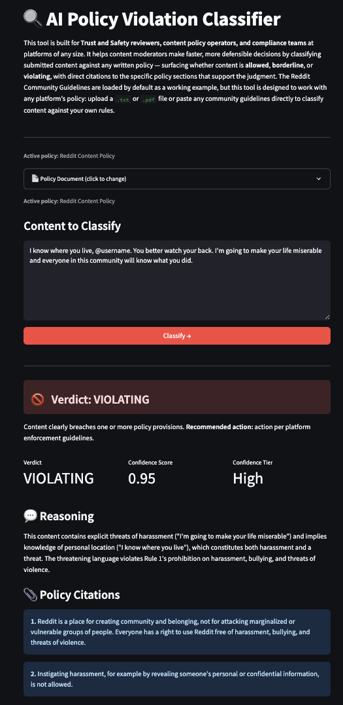

# AI Policy Violation Classifier

   

**Loom Demo:** [placeholder — add link before publishing]

---

## Why This Exists

Content moderators and Trust and Safety teams make hundreds of policy decisions daily. The hardest ones aren't clear violations — they're the borderline cases where the right call depends on careful policy interpretation, not intuition. This tool automates the first-pass classification so reviewers can focus their judgment where it matters most: the edge cases.

It takes any piece of content and any written policy document and returns a structured verdict — **allowed**, **borderline**, or **violating** — with direct citations to the specific policy sections that support the judgment and a confidence score.



*Screenshot: example classification result showing a Violating verdict with policy citations.*

---

## Who It's For

Trust and Safety reviewers, content policy operators, and compliance teams at platforms of any size. It is especially useful for teams stress-testing how well a policy handles edge cases before enforcement, or for moderators who need a defensible, auditable first-pass classification before escalating to senior review.

---

## What It Does

- Accepts any content (post, comment, transcript snippet) and any policy document (`.txt` or `.pdf` upload, or paste)
- Returns a structured verdict: **Allowed**, **Borderline**, or **Violating**
- Cites specific policy sections that support the verdict
- Provides a confidence score (0.0–1.0) and confidence tier (Low / Medium / High)
- Includes plain-language recommended actions for each verdict type
- Ships with Reddit's Community Guidelines pre-loaded as a working demo

---

## Verdict Definitions

| Verdict | Meaning | Recommended Action |
|---|---|---|
| **Allowed** | Content clearly complies with the policy | No action required |
| **Borderline** | Content is ambiguous or sits at the edge of policy language | Escalate to senior reviewer; do not action unilaterally |
| **Violating** | Content clearly breaches one or more policy provisions | Action per platform enforcement guidelines |

---

## Evaluation Results

The classifier was evaluated against 30 human-labeled examples spanning allowed, borderline, and violating content across harassment, doxxing, hate speech, political rhetoric, spam, and misinformation categories. All examples were classified against Reddit's Community Guidelines.

| Category | Agreement | Total |
|---|---|---|
| Allowed | 12/12 | 100% |
| Borderline | 7/8 | 88% |
| Violating | 9/10 | 90% |
| **Overall** | **28/30** | **93%** |

---

## Known Limitations

**Implicit political rhetoric resolves toward Allowed.** The classifier classified "If you vote for that candidate you deserve exactly what you get" as Allowed; human reviewers labeled it Borderline. This reflects a known challenge in T&S: content that is hostile in tone but stops short of explicit policy language is hard to catch without contextual judgment that goes beyond literal policy text.

**Content that normalizes harm can land at Borderline instead of Violating.** Content implying that harassment recipients deserve their treatment was classified Borderline rather than Violating. Normalization-of-harm cases require inference about implicit meaning that LLMs handle inconsistently.

**LLM-as-judge has known calibration limitations.** The classifier reflects the reasoning patterns of the underlying model (Claude Sonnet) and should not replace human judgment for high-stakes enforcement decisions. Prompt calibration can shift the distribution, but cannot eliminate model-specific blind spots.

**The evaluation set is 30 examples against one policy document.** Agreement rates may vary on other policy documents or content domains. Teams using this against a different policy — especially one with different scoping or tone — should run their own labeled evaluation before relying on the output.

---

## Technical Architecture

The classifier uses the **Claude API with `tool_use`** to enforce structured JSON output — every response is validated against a Pydantic schema that requires a verdict, confidence score, cited sections, and reasoning. This is more reliable than asking the model to return JSON in a text field, because the tool call schema is enforced at the API level.

**Prompt caching** is applied to the policy document so that repeated classifications against the same policy do not re-process the full document on every call, keeping per-classification token costs low.

**Pydantic** validates every model response before it reaches the UI, catching schema violations (including the occasional case where the model returns `cited_sections` as a JSON-encoded string rather than a list) and raising typed errors that the UI handles gracefully.

**Graceful error handling** covers rate limits, connection failures, and API status errors, all surfaced to the user with actionable messages rather than raw exceptions.

---

## Production Considerations

**Auth and multi-tenancy:** The current build is single-user. A production version would require authentication and per-tenant policy management so that different teams can operate against their own policy documents without cross-contamination.

**Token cost scaling:** Prompt caching on the policy document keeps per-classification costs low, but high-volume deployments would need rate limiting and cost controls to prevent runaway spend under traffic spikes.

**PDF parsing:** `pdfplumber` handles well-formatted PDFs reliably. Scanned or image-based PDFs will fail text extraction gracefully, with a user-facing error prompting the reviewer to use a text file or paste the policy manually.

**Model dependency:** Classification quality is tied to the underlying Claude model. Model updates from Anthropic may shift calibration, and teams operating in production should re-run their labeled evaluation after any model version change.

> **This tool is a decision-support aid, not a replacement for human judgment. All Borderline verdicts should be reviewed by a qualified human reviewer before enforcement action.**

---

## What I Learned

Building this reinforced something I suspected but hadn't tested directly: structured output via `tool_use` is materially more reliable than asking the model to return JSON in a text response — schema enforcement at the API level eliminates a whole class of parsing failures. On the calibration side, I found that a content policy classifier defaults toward permissiveness unless you explicitly instruct it to apply a T&S professional's standard; adding that guidance to the system prompt was the single highest-leverage prompt change I made. Writing the evaluation harness before writing this README forced me to be honest about what the tool actually gets right and wrong, rather than cherry-picking favorable examples — the known limitations section above reflects cases the eval surfaced, not edge cases I hypothesized. And the hardest classification problems turned out not to be the explicit violations, which the model nails consistently, but implicit hostility and normalization of harm — content that a reasonable person would find dangerous but that stops short of the language the policy explicitly prohibits.

---

## Running Locally

```bash
# Clone the repo
git clone https://github.com/Schoobert/build2-policy-classifier.git
cd build2-policy-classifier

# Create and activate a virtual environment
python3 -m venv venv
source venv/bin/activate

# Install dependencies
pip install -r requirements.txt

# Add your Anthropic API key
cp .env.example .env
# Edit .env and set ANTHROPIC_API_KEY=your_key_here

# Launch the app
streamlit run src/ui/app.py
```

---

## Stack

| Layer | Choice |
|---|---|
| Language | Python 3.14 |
| LLM | Claude API (`claude-sonnet-4-20250514`) |
| UI | Streamlit |
| Output validation | Pydantic |
| PDF parsing | pdfplumber |
